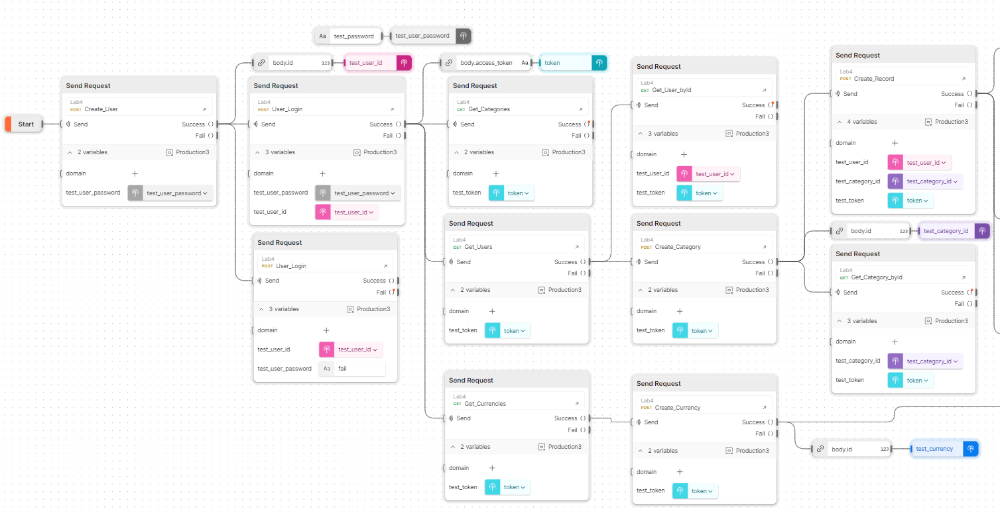

# BackLabs
Repository for Backend Labs

# Render
https://backlabs-lab4.onrender.com/healthcheck

# Postman Collection
https://api.postman.com/collections/31806616-a2cf8fe6-f4b0-4406-97de-ffd86c3dad31?access_key=PMAT-01HJ79A23PHX5JY16V1BP2RE78

Don't forget to aply environment (Production3)

# Postman Flow picture
link: https://web.postman.co/workspace/1cef47a4-2011-4e56-8164-029b7387fa4d/flow/6584a875ed23e10032f12dbb




# Розрахунок варіанту:

Номер у списку групи: 25

```
25 % 3 = 1
```

Отже, мій варіант додаткового завдання: "Валюти"


```
Для валют - потрібно зробити окрему сутність, також для кожного користувача повинна бути валюта по замовчуванню(її можна встановити) а також при створенні витрати, можна вказувати валюту, проте не обов’язково(якщо не вказали то буде використана валюта по замовчуванню).
```

# Lab4

## Setup
Для запуску у себе на пк 

Потрібно клонувати проект в свою робочу директорію:
```
> git clone https://github.com/Napchik/BackLabs/tree/Lab4
```
Встановити flask та requirements за допомогою команд:
```
> pip install flask
> pip install -r requirements.txt
```
Тут є .flaskenv файл, тому потрібно поставити python-dotenv:
```
> pip install python-dotenv
```

## Docker
Далі потрібно збілдити image такою командою:
```
>  docker build . --tag <image-name>:latest
Example: docker build . --tag lab4:latest
```
Якщо image упішно збілдився, то його можна запустити і перевірити:
```
> docker run -d -p 5000:5000 <image-name>
Example: docker run -d -p 5000:5000 lab4
```

## Docker-compose
Збілдити контейнер: 
```
> docker-compose build
```
Запустити контейнер:
```
> docker-compose up
```
## Список енд-поинтів
Get:
```
<domen>/users
<domen>/categories
<domen>/records (acquires user_id or category_id)
<domen>/currencies

<domen>/user/<user_id>
<domen>/category/<category_id>
<domen>/record/<record_id>
<domen>/currency/<currency_id>
```
Post:
```
<domen>/user
<domen>/category
<domen>/record
<domen>/currency
<domen>/login
```

Delete:
```
<domen>/user/<user_id>
<domen>/category/<category_id>
<domen>/record/<record_id>
<domen>/currency/<currency_id>
```

